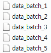
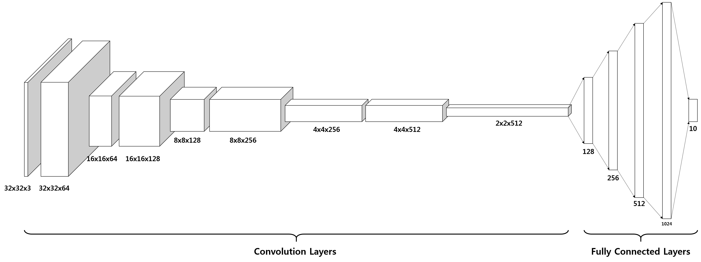

本文利用 tensorflow 构建 cnn 模型，对之前所学的内容加以运用。

## 下载并预处理数据集

执行以下代码即可完成代码的下载（可能需要科学上网才能下载）：

```python
from urllib.request import urlretrieve
from os.path import isfile, isdir
from tqdm import tqdm 
import tarfile

cifar10_dataset_folder_path = 'cifar-10-batches-py'

# 下载数据集
class DownloadProgress(tqdm):
    last_block = 0

    def hook(self, block_num=1, block_size=1, total_size=None):
        self.total = total_size
        self.update((block_num - self.last_block) * block_size)
        self.last_block = block_num

# 文件不存在则下载
if not isfile('cifar-10-python.tar.gz'):
    with DownloadProgress(unit='B', unit_scale=True, miniters=1, desc='CIFAR-10 Dataset') as pbar:
        urlretrieve(
            'https://www.cs.toronto.edu/~kriz/cifar-10-python.tar.gz',
            'cifar-10-python.tar.gz',
            pbar.hook)
# 下载的文件未解压，则解压
if not isdir(cifar10_dataset_folder_path):
    with tarfile.open('cifar-10-python.tar.gz') as tar:
        tar.extractall()
        tar.close()
```

数据集下载好了，简单了解一下 CIFAR10 数据集吧。

下载并解压好的文件如下：



每个文件的内容都是： (10000 , 3072) 的维度，其中 3072 = 32\*32\*3。

数据的类别如下：'airplane', 'automobile', 'bird', 'cat', 'deer', 'dog', 'frog', 'horse', 'ship', 'truck' 共10个类别，我们可以通过以下函数来获取类别数组：

```python
def load_label_names():
    return ['airplane', 'automobile', 'bird', 'cat', 'deer', 'dog', 'frog', 'horse', 'ship', 'truck']
```

作为CNN的输入，我们希望维度为(10000, 32, 32, 3)，因此需要一些reshape操作以及转置操作。并且，如果能对数据进行一些基本的变换，例如镜像翻转，那么就可以增加数据集的数量了。

```python
import pickle
import numpy as np
import matplotlib.pyplot as plt

# 载入数据，对数据集进行扩展
def load_cfar10_batch(cifar10_dataset_folder_path, batch_id):
    with open(cifar10_dataset_folder_path + '/data_batch_' + str(batch_id), mode='rb') as file:
        # 指定编码类型为 'latin1'
        batch = pickle.load(file, encoding='latin1')
    # 进行reshape和transpose操作
    features = batch['data'].reshape((len(batch['data']), 3, 32, 32)).transpose(0, 2, 3, 1)
    
    # 对图像进行镜像处理（仅仅是镜像翻转就可以提升 7% - 8% 的精确度）
    flip_features = np.flip(features, axis=2)
    
    # 把镜像处理的图像添加到数据集中
    features = np.append(features, flip_features, axis=0)
    
    
    labels = batch['labels']
    # 为上面镜像操作生成的数据集设置 label
    labels = np.append(labels, labels, axis=0)
        
    return features, labels
```

虽然数据以及可以通过上面的函数加载了，但是我们还要对数据进行标准化操作。下面是对图片数据进行标准化的函数：

```python
# 将数据标准化
def normalize(x):
    min_val = np.min(x)
    max_val = np.max(x)
    x = (x-min_val) / (max_val-min_val)
    return x
```

我们将会用到 Softmax 预测属于各个类别的概率，所以我们对 label 进行 one-hot 编码：

```python
# 对　lａbels　进行　one hot 编码
def one_hot_encode(lａbels):
    encoded = np.zeros((len(lａbels), 10))
    
    for idx, val in enumerate(lａbels):
        encoded[idx][val] = 1
    
    return encoded
```

我们把训练集合分为两部分，90%的部分用于训练，10%的部分用于验证训练效果：


```python
# 预处理操作具体内容：
# 1.特征标准化; 
# 2.label 转成 one-hot 编码
def _preprocess_and_save(normalize, one_hot_encode, features, labels, filename):
    features = normalize(features)
    labels = one_hot_encode(labels)
    # 输出文件到　filename　中
    pickle.dump((features, labels), open(filename, 'wb'))


# 对训练集和测试集进行预处理
def preprocess_and_save_data(cifar10_dataset_folder_path, normalize, one_hot_encode):
    n_batches = 5
    # 下面两个列表用于保存各个文件 后10%的数据
    valid_features = []
    valid_labels = []

    # 将５个文件中保存的训练集合分为90%的训练集合和10%的验证集
    for batch_i in range(1, n_batches + 1):
        # 对数据集进行 reshape 和 transpose 操作
        features, labels = load_cfar10_batch(cifar10_dataset_folder_path, batch_i)
        
        # 以下变量用于辅助 找到验证集起始序号
        index_of_validation = int(len(features) * 0.1)

        # p预处理当前 batch 前90%的数据：
        # - 标准化特征
        # - 对label 进行 one_hot 编码
        # - 将处理好的数据保存到新文件中： "preprocess_batch_" + batch_number
        # 对每个 batch 进行这样的处理
        _preprocess_and_save(normalize, one_hot_encode,
                             features[:-index_of_validation], labels[:-index_of_validation], 
                             'preprocess_batch_' + str(batch_i) + '.p')

        
        # 抽取每个batch中后10%的数据存入数组valid_features和valid_labels
        valid_features.extend(features[-index_of_validation:])
        valid_labels.extend(labels[-index_of_validation:])

    # 对保存在数组valid_features和valid_labels中的验证集进行预处理，并保存到新文件中
    _preprocess_and_save(normalize, one_hot_encode,
                         np.array(valid_features), np.array(valid_labels),
                         'preprocess_validation.p')

    # 加载测试集
    with open(cifar10_dataset_folder_path + '/test_batch', mode='rb') as file:
        batch = pickle.load(file, encoding='latin1')

    # 对测试集进行 reshape 和 transpose 操作
    test_features = batch['data'].reshape((len(batch['data']), 3, 32, 32)).transpose(0, 2, 3, 1)
    test_labels = batch['labels']

    # 对测试集进行预处理，并保存到新文件中
    _preprocess_and_save(normalize, one_hot_encode,
                         np.array(test_features), np.array(test_labels),
                         'preprocess_training.p')
```

调用上面的函数完成图片的预处理：

```pytho
preprocess_and_save_data(cifar10_dataset_folder_path, normalize, one_hot_encode)
```

并使用下面的函数载入预处理过的验证集的数据文件：

```python
valid_features, valid_labels = pickle.load(open('preprocess_validation.p', mode='rb'))
```

到这里数据的处理就完成了。

## 构建 CNN 模型

模型大致如下图所示：



```python
import tensorflow as tf
# 重置计算图，避免变量重复
tf.reset_default_graph()

# 构建前L-1层神经网络模型
def conv_net(x, keep_prob):
    conv1_filter = tf.Variable(tf.truncated_normal(shape=[3, 3, 3, 64], mean=0, stddev=0.05))
    conv2_filter = tf.Variable(tf.truncated_normal(shape=[3, 3, 64, 128], mean=0, stddev=0.05))
    conv3_filter = tf.Variable(tf.truncated_normal(shape=[5, 5, 128, 256], mean=0, stddev=0.05))
    conv4_filter = tf.Variable(tf.truncated_normal(shape=[5, 5, 256, 512], mean=0, stddev=0.05))

    # 1, 2
    conv1 = tf.nn.conv2d(x, conv1_filter, strides=[1,1,1,1], padding='SAME')
    conv1 = tf.nn.relu(conv1)
    conv1_pool = tf.nn.max_pool(conv1, ksize=[1,2,2,1], strides=[1,2,2,1], padding='SAME')
    conv1_bn = tf.layers.batch_normalization(conv1_pool)

    # 3, 4
    conv2 = tf.nn.conv2d(conv1_bn, conv2_filter, strides=[1,1,1,1], padding='SAME')
    conv2 = tf.nn.relu(conv2)
    conv2_pool = tf.nn.max_pool(conv2, ksize=[1,2,2,1], strides=[1,2,2,1], padding='SAME')    
    conv2_bn = tf.layers.batch_normalization(conv2_pool)
  
    # 5, 6
    conv3 = tf.nn.conv2d(conv2_bn, conv3_filter, strides=[1,1,1,1], padding='SAME')
    conv3 = tf.nn.relu(conv3)
    conv3_pool = tf.nn.max_pool(conv3, ksize=[1,2,2,1], strides=[1,2,2,1], padding='SAME')  
    conv3_bn = tf.layers.batch_normalization(conv3_pool)
    
    # 7, 8
    conv4 = tf.nn.conv2d(conv3_bn, conv4_filter, strides=[1,1,1,1], padding='SAME')
    conv4 = tf.nn.relu(conv4)
    conv4_pool = tf.nn.max_pool(conv4, ksize=[1,2,2,1], strides=[1,2,2,1], padding='SAME')
    conv4_bn = tf.layers.batch_normalization(conv4_pool)
    
    # 9
    flat = tf.contrib.layers.flatten(conv4_bn)  

    # 10
    full1 = tf.contrib.layers.fully_connected(inputs=flat, num_outputs=128, activation_fn=tf.nn.relu)
    full1 = tf.nn.dropout(full1, keep_prob[0])
    full1 = tf.layers.batch_normalization(full1)
    
    # 11
    full2 = tf.contrib.layers.fully_connected(inputs=full1, num_outputs=256, activation_fn=tf.nn.relu)
    full2 = tf.nn.dropout(full2, keep_prob[1])
    full2 = tf.layers.batch_normalization(full2)
    
    # 12
    full3 = tf.contrib.layers.fully_connected(inputs=full2, num_outputs=512, activation_fn=tf.nn.relu)
    full3 = tf.nn.dropout(full3, keep_prob[2])
    full3 = tf.layers.batch_normalization(full3)    
    
    # 13
    full4 = tf.contrib.layers.fully_connected(inputs=full3, num_outputs=1024, activation_fn=tf.nn.relu)
    full4 = tf.nn.dropout(full4, keep_prob[3])
    full4 = tf.layers.batch_normalization(full4)        
    
    # 14
    out = tf.contrib.layers.fully_connected(inputs=full3, num_outputs=10, activation_fn=None)
    return out
```

设置变量和参数：

```python
# 为要输入的数据创建 placeholder
x = tf.placeholder(tf.float32, shape=(None, 32, 32, 3), name='input_x')
y =  tf.placeholder(tf.float32, shape=(None, 10), name='output_y')
keep_prob = tf.placeholder(tf.float32, name='keep_prob')

# 设置超参数
epochs = 12
# batch_size 根据自己的硬件情况设置合适的值
batch_size = 128
# 为4个全连接层设置4个keep_prob
keep_probability = [0.7, 0.7, 0.8, 0.8]
learning_rate = 0.0005
```

设置成本函数和优化器：

```python
# 得到前 L-1 层输出
logits = conv_net(x, keep_prob)

# logics 的值存放在内存中，
# 单独运行测试代码时，无法直接从内存中获取到变量 logics 的值
# tf.identity 将变量 logits 命名为 logics 放人计算图中，然后保存模型到磁盘
# 下次即可从磁盘可获取到 logics 的值
model = tf.identity(logits, name='logits')

# 设置成本函数和优化器
cost = tf.reduce_mean(tf.nn.softmax_cross_entropy_with_logits_v2(logits=logits, labels=y))
optimizer = tf.train.AdamOptimizer(learning_rate=learning_rate).minimize(cost)

# 计算准确度
correct_pred = tf.equal(tf.argmax(logits, 1), tf.argmax(y, 1))
accuracy = tf.reduce_mean(tf.cast(correct_pred, tf.float32), name='accuracy')
```

## 训练神经网络

代码如下：

```python
# 对一个 batch 进行梯度下降
def train_neural_network(session, optimizer, keep_probability, feature_batch, label_batch):
    session.run(optimizer, 
                feed_dict={
                    x: feature_batch,
                    y: label_batch,
                    keep_prob: keep_probability
                })

# 显示当前batch的状态
def print_stats(session, feature_batch, label_batch, cost, accuracy):
    loss = sess.run(cost, 
                    feed_dict={
                        x: feature_batch,
                        y: label_batch,
                        keep_prob: [1, 1, 1, 1]
                    })
    valid_acc = sess.run(accuracy, 
                         feed_dict={
                             x: valid_features,
                             y: valid_labels,
                             keep_prob: [1, 1, 1, 1]
                         })
    
    print('Loss: {:>10.4f} Validation Accuracy: {:.6f}'.format(loss, valid_acc))

# 将特征和label分割成batch_size大小
def batch_features_labels(features, labels, batch_size):
    for start in range(0, len(features), batch_size):
        end = min(start + batch_size, len(features))
        yield features[start:end], labels[start:end]

# 根据 batch_id 加载预处理的训练集，返回batch_size个数据
def load_preprocess_training_batch(batch_id, batch_size):
    """
    Load the Preprocessed Training data and return them in batches of <batch_size> or less
    """
    filename = 'preprocess_batch_' + str(batch_id) + '.p'
    features, labels = pickle.load(open(filename, mode='rb'))

    # 调用batch_features_labels 返回batch_size大小的数据
    return batch_features_labels(features, labels, batch_size)

# 神经网络模型保存位置
save_model_path = './image_classification'

print('Training...')
with tf.Session() as sess:
    # 初始化参数
    sess.run(tf.global_variables_initializer())
    
    # 开始训练
    for epoch in range(epochs):
        # Loop over all batches
        n_batches = 5
        for batch_i in range(1, n_batches + 1):
            for batch_features, batch_labels in load_preprocess_training_batch(batch_i, batch_size):
                train_neural_network(sess, optimizer, keep_probability, batch_features, batch_labels)
                
            print('Epoch {:>2}, CIFAR-10 Batch {}:  '.format(epoch + 1, batch_i), end='')
            print_stats(sess, batch_features, batch_labels, cost, accuracy)
            
    # 保存模型
    saver = tf.train.Saver()
    save_path = saver.save(sess, save_model_path)
```

部分输出结果如下：

> Epoch 10, CIFAR-10 Batch 4:  Loss:     0.0172 Validation Accuracy: 0.805100
> Epoch 10, CIFAR-10 Batch 5:  Loss:     0.0053 Validation Accuracy: 0.814700
> Epoch 11, CIFAR-10 Batch 1:  Loss:     0.0055 Validation Accuracy: 0.823600
> Epoch 11, CIFAR-10 Batch 2:  Loss:     0.0034 Validation Accuracy: 0.819900
> Epoch 11, CIFAR-10 Batch 3:  Loss:     0.0059 Validation Accuracy: 0.808400
> Epoch 11, CIFAR-10 Batch 4:  Loss:     0.0074 Validation Accuracy: 0.812500
> Epoch 11, CIFAR-10 Batch 5:  Loss:     0.0298 Validation Accuracy: 0.818700
> Epoch 12, CIFAR-10 Batch 1:  Loss:     0.0043 Validation Accuracy: 0.817400
> Epoch 12, CIFAR-10 Batch 2:  Loss:     0.0018 Validation Accuracy: 0.818300
> Epoch 12, CIFAR-10 Batch 3:  Loss:     0.0065 Validation Accuracy: 0.814400
> Epoch 12, CIFAR-10 Batch 4:  Loss:     0.0043 Validation Accuracy: 0.809000
> Epoch 12, CIFAR-10 Batch 5:  Loss:     0.0072 Validation Accuracy: 0.816200

## 测试神经网络

由于训练的时候，将数据已经保存到磁盘中，所以我们只需要载入之前训练好的参数即可完成测试，以下代码可以单独作为一个文件运行。

```python
import pickle
import numpy as np
import matplotlib.pyplot as plt
import tensorflow as tf

# 重置计算图，避免变量重复
tf.reset_default_graph()

save_model_path = './image_classification'
batch_size = 64
# 随机抽取的样本数量
n_samples = 15

# 每次返回batch-size个数据
def batch_features_labels(features, labels, batch_size):
    """
    Split features and labels into batches
    """
    for start in range(0, len(features), batch_size):
        end = min(start + batch_size, len(features))
        yield features[start:end], labels[start:end]

# 关于加载模型的相关代码，可以参考以下链接：
# https://blog.csdn.net/huachao1001/article/details/78501928
def test_model():
    # 载入预处理过的测试集
    test_features, test_labels = pickle.load(open('preprocess_training.p', mode='rb'))
    # 显式声明一个图，后面都对这张图进行操作
    # 参考：https://blog.csdn.net/zj360202/article/details/78539464
    loaded_graph = tf.Graph()

    with tf.Session(graph=loaded_graph) as sess:
        # Load model
        loader = tf.train.import_meta_graph(save_model_path + '.meta')
        loader.restore(sess, save_model_path)

        # Get Tensors from loaded model
        loaded_x = loaded_graph.get_tensor_by_name('input_x:0')
        loaded_y = loaded_graph.get_tensor_by_name('output_y:0')
        loaded_keep_prob = loaded_graph.get_tensor_by_name('keep_prob:0')
        loaded_logits = loaded_graph.get_tensor_by_name('logits:0')
        loaded_acc = loaded_graph.get_tensor_by_name('accuracy:0')
        
        # Get accuracy in batches for memory limitations
        test_batch_acc_total = 0
        test_batch_count = 0
        
        for train_feature_batch, train_label_batch in batch_features_labels(test_features, test_labels, batch_size):
            test_batch_acc_total += sess.run(
                loaded_acc,
                feed_dict={loaded_x: train_feature_batch, loaded_y: train_label_batch, loaded_keep_prob: [1.0,1.0,1.0,1.0]})
            test_batch_count += 1

        print('Testing Accuracy: {}\n'.format(test_batch_acc_total/test_batch_count))

        # Print Random Samples
        random_test_features, random_test_labels = tuple(zip(*random.sample(list(zip(test_features, test_labels)), n_samples)))
        loaded_logits = sess.run(loaded_logits,
            feed_dict={loaded_x: random_test_features, loaded_y: random_test_labels, loaded_keep_prob: [1.0,1.0,1.0,1.0]})
        pred = tf.nn.softmax(loaded_logits)
        pred_result = np.argmax(pred.eval(), axis = 1)
        act_result = np.argmax(random_test_labels, axis = 1)
        
        label_names = load_label_names()
        for i in range(n_samples):
          pred_c = label_names[pred_result[i]]
          act_c = label_names[act_result[i]]
          print("是否正确:", "是" if act_c== pred_c else "否", "预测类别:", pred_c, "实际类别:", act_c )


test_model()
```

输出如下：

> Testing Accuracy: 0.7881170382165605
> 是否正确: 是 预测类别: horse 实际类别: horse
> 是否正确: 是 预测类别: truck 实际类别: truck
> 是否正确: 是 预测类别: dog 实际类别: dog
> 是否正确: 是 预测类别: ship 实际类别: ship
> 是否正确: 否 预测类别: airplane 实际类别: truck
> 是否正确: 是 预测类别: horse 实际类别: horse
> 是否正确: 是 预测类别: horse 实际类别: horse
> 是否正确: 是 预测类别: deer 实际类别: deer
> 是否正确: 是 预测类别: frog 实际类别: frog
> 是否正确: 否 预测类别: cat 实际类别: frog
> 是否正确: 是 预测类别: horse 实际类别: horse
> 是否正确: 是 预测类别: airplane 实际类别: airplane
> 是否正确: 是 预测类别: frog 实际类别: frog
> 是否正确: 是 预测类别: airplane 实际类别: airplane
> 是否正确: 否 预测类别: horse 实际类别: deer

