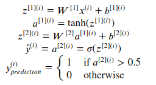
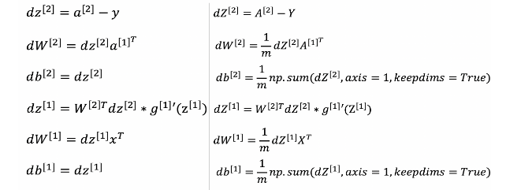
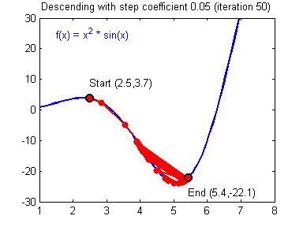
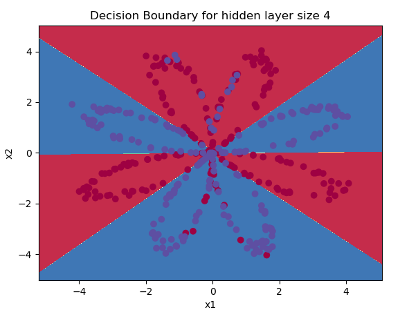
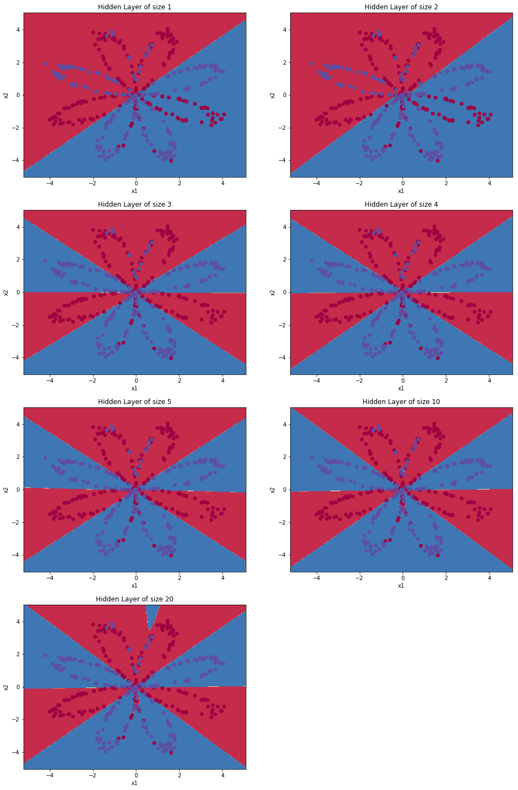
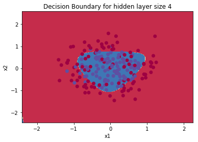

这篇文章，我们来看看如何利用带有一个隐藏层的神经网络实现平面数据的分类，其中大部分的代码逻辑和我们之前几篇文章所说的内容都是相符合的。本文档是从吴恩达的深度学习课程第一课第三周编程作业精简后简单翻译来的，也许有翻译不到位的地方，凑合看看吧。

如果你对英文水平有信心，本文还有一个全英文 jupyter notebook 的版本，[在这个链接里](https://github.com/zxxwin/DLnote/tree/master/jupyter%20notebook/Neural%20Network)。

## 1. 开始前的准备 ##

本文使用的是 Anaconda 提供的 python3.7 以及以下库的支持：

- [numpy](www.numpy.org) 不多说了，科学计算必备的库
- [sklearn](http://scikit-learn.org/stable/) 提供一些用于数据分析的 样本 和 高效率工具
- [matplotlib](http://matplotlib.org) 利用python进行绘图的库.

如果你没有安装过上面说的的库，那我也建议你安装下Anaconda，会省事很多：[下载地址](https://www.anaconda.com/download/#windows)

另外，我们还需要借助一些吴恩达老师提供的工具函数testCases.py 和 planar_utils.py（[可以从这个链接下载](https://github.com/zxxwin/DLnote/tree/master/python%20code/Neural%20Network)）：

- testCases 提供测试样本来评估我们的模型。provides some test examples to assess the correctness of your functions
- planar_utils 提供各种有用的函数

这两个文件里的函数实现这里就不讨论了，超出本文的讨论范围，我们只要知道，他们是提供数据的就好。


```python
# Package imports
import numpy as np
import matplotlib.pyplot as plt
from testCases import *
import sklearn
import sklearn.datasets
import sklearn.linear_model
from planar_utils import plot_decision_boundary, sigmoid, load_planar_dataset, load_extra_datasets
```

## 2. 数据集 ##

以下的load_planar_dataset() 返回训练集`X` 和测试集 `Y`.


```python
X, Y = load_planar_dataset() 
```

数据集的说明：

- X是(2, 400)的训练集，两个维度分别代表平面的两个坐标。
- Y是(1, 400)的测试集，每个元素的值是0（代表红色），或者1（代表蓝色）

利用 matplotlib 进行数据的可视化操作，这是一个由红点和蓝色的点构成的类似花状的图像。


```python
# Visualize the data:
plt.scatter(X[0, :], X[1, :], c=np.squeeze(Y), s=40, cmap=plt.cm.Spectral);
plt.show()
```


## 3. 构建神经网络模型

我们将使用含义一个隐藏层的神经网络来进行分类操作，模型如下：

**Here is our model**:


对于某个样本 x^[i]：



成本函数 J ：


接下来我们要用代码实现神经网络的结构，步骤大致如下：
​    1. 定义神经网络结构 
​    2. 随机初始化参数
​    3. 不断迭代:
​        - 正向传播
​        - 计算成本函数值
​        - 利用反向传播得到梯度值
​        - 更新参数（梯度下降）

### 3.1 定义神经网络的结构

主要任务就是能描述网络各个层的单元个数，因此编写如下函数：


```python
def layer_sizes(X, Y):
    n_x = X.shape[0] # 输入层单元数量
    n_h = 4          # 隐藏层单元数量，在这个模型中，我们设置成4即可
    n_y = Y.shape[0] # 输出层单元数量
    
    return (n_x, n_h, n_y)
```

### 3. 2 随机初始化参数

参数W的随机初始化是很重要的，如果W和b都初始化成0，那么这一层的所有单元的输出值都一样，导致反向传播时，所有的单元的参数都做出完全相同的调整，这样多个单元的效果和只有一个单元的效果是相同的。为了避免这样的情况发生，我们会把参数W初始化。

另外，随机初始化W之后，我们还会乘上一个较小的常数，比如 0.01 ，这样是为了保证输出值 Z 数值都不会太大。为什么这么做？设想我们用的激活函数是 sigmoid 或者 tanh ，那么，太大的 Z 会导致最终 A 会落在函数图像中比较平坦的区域内，这样的地方梯度都接近于0，会降低梯度下降的速度，因此我们会将权重初始化为较小的随机值。

具体的代码实现如下：


```python
def initialize_parameters(n_x, n_h, n_y):
    W1 = np.random.randn(n_h, n_x) * 0.01
    b1 = np.zeros((n_h, 1))
    W2 = np.random.randn(n_y, n_h) * 0.01
    b2 = np.zeros((n_y, 1))
    
    parameters = {"W1": W1,
                  "b1": b1,
                  "W2": W2,
                  "b2": b2}
    
    return parameters
```

### 3.3 循环迭代部分

**3.3.1 实现正向传播**

这部分代码的逻辑可以参考[浅层神经网络的正向传播过程](https://www.zxxblog.cn/article/100)


```python
def forward_propagation(X, parameters):
    # 从parameters中取出参数
    W1 = parameters["W1"]
    b1 = parameters["b1"]
    W2 = parameters["W2"]
    b2 = parameters["b2"]
    
    # 执行正向传播操作
    Z1 = np.dot(W1, X) + b1
    A1 = np.tanh(Z1)
    Z2 = np.dot(W2, A1) + b2
    A2 = sigmoid(Z2)
    
    cache = {"Z1": Z1,
             "A1": A1,
             "Z2": Z2,
             "A2": A2}
    
    return A2, cache
```

**3.3.2  计算成本函数 J **

既然我们在上一段代码中计算出了由多个a^[2] (i)组成的矩阵 A^[2] ，现在可以进一步计算成本函数 J 了：


```python
def compute_cost(A2, Y, parameters):
    m = Y.shape[1] # 样本个数

    # 下一行的结果是 (1, m)的矩阵
    logprobs = np.multiply(Y, np.log(A2)) + np.multiply(1-Y, np.log(1 - A2)) 
    
    # 将 (1, m)的矩阵求和后取平均值
    cost = - 1/m * np.sum(logprobs) 
    
    # np.squeeze()函数对矩阵进行压缩维度，删除单维度条目，即把shape中为1的维度去掉
    # 例如： np.squeeze([[ 1.23 ]]) 可以将维度压缩，最终变成 1.23
    # 目的是确保 cost 是一个浮点数
    cost = np.squeeze(cost)     
    
    return cost
```

利用正向传播函数返回的cache，我们现在可以实现反向传播了。



> 说明：
>
>  我们使用的 g^[1] () 是 tanh ，并且 A1 =  g^[1] ( Z^[1] ) ,那么求导变形后可以得到  g‘ ^[1] ( Z^[1] ) = 1-(  A^[1]  )^2 用python表示为：  1 - np.power(A1, 2)
>
> 我们使用的 g^[2] () 是 sigmoid ，并且 A2 =  g^[2] ( Z^[2] ) ,那么求导变形后可以得到  g‘ ^[2] ( Z^[2] ) =A^2 - Y


```python
def backward_propagation(parameters, cache, X, Y):
    # 获取样本的数量
    m = X.shape[1]
    
    # 从 parameters 和 cache 中取得参数
    W1 = parameters["W1"]
    W2 = parameters["W2"]
    A1 = cache["A1"]
    A2 = cache["A2"]
    
    # 计算梯度 dW1, db1, dW2, db2. 
    dZ2 = A2 - Y
    dW2 = 1/m * np.dot(dZ2, A1.T)
    db2 = 1/m * np.sum(dZ2, axis = 1, keepdims = True)
    dZ1 = np.multiply(np.dot(W2.T, dZ2), 1 - np.power(A1, 2))
    dW1 = 1/m * np.dot(dZ1, X.T)
    db1 = 1/m * np.sum(dZ1, axis = 1, keepdims = True)
    
    grads = {"dW1": dW1,
             "db1": db1,
             "dW2": dW2,
             "db2": db2}
    
    return grads
```

> 说明：
>
> 1  计算db^[1]和db^[2]时的程序代码的sum函数的第二个参数 axis=1 表示水平相加求和。
>
> 2  keepdims=True是为了保持矩阵的shape属性值是我们熟悉的()中有两个数字的形式，例如(1, m)，(4, m)等，如果不加上可能得到的是奇怪的(1, )，(4, )这样的形式。


**3.3.3  更新参数** 

利用上面反向传播的代码段获得的梯度去更新 (W1, b1, W2, b2)：


式子中 α 是学习率，较小的学习率的值会降低梯度下降的速度，但是可以保证成本函数 J 可以在最小值附近收敛：


而较大的学习率让梯度下降速度较快，但是可能会因为下降的步子太大而越过最低点，最终无法在最低点附近出收敛：



这里我们选择1.2作为学习率，学习率的如何取值，我们之后再说。


```python
def update_parameters(parameters, grads, learning_rate = 1.2):
    W1 = parameters["W1"]
    b1 = parameters["b1"]
    W2 = parameters["W2"]
    b2 = parameters["b2"]
    
    dW1 = grads["dW1"]
    db1 = grads["db1"]
    dW2 = grads["dW2"]
    db2 = grads["db2"]
    
    
    # 更新参数
    W1 -= learning_rate * dW1
    b1 -= learning_rate * db1
    W2 -= learning_rate * dW2
    b2 -= learning_rate * db2
    
    parameters = {"W1": W1,
                  "b1": b1,
                  "W2": W2,
                  "b2": b2}
    
    return parameters
```

**3.3.4 构建完整的神经网络模型**

整合上面的 3.3.1、 3.3.2、 3.3.3 为完整的神经网络模型nn_model：


```python
def nn_model(X, Y, n_h, num_iterations = 10000, print_cost=False):
    # 输入层单元数
    n_x = layer_sizes(X, Y)[0] 
    # 输出层单元数
    n_y = layer_sizes(X, Y)[2] 
    
    # 随机初始化参数
    parameters = initialize_parameters(n_x, n_h, n_y) 
    W1 = parameters["W1"]
    b1 = parameters["b1"]
    W2 = parameters["W2"]
    b2 = parameters["b2"]
    
    # 10000次梯度下降的迭代
    for i in range(0, num_iterations):
        # 正向传播，得到Z1、A1、Z2、A2
        A2, cache = forward_propagation(X, parameters)
        
        # 计算成本函数的值
        cost = compute_cost(A2, Y, parameters)
 
        # 反向传播，得到各个参数的梯度值
        grads = backward_propagation(parameters, cache, X, Y)
 
        # 更新参数
        parameters = update_parameters(parameters, grads, learning_rate = 1.2)
        
        # 每迭代1000下就输出一次cost值
        if print_cost and i % 1000 == 0:
            print ("Cost after iteration %i: %f" %(i, cost))

    # 返回最终训练好的参数
    return parameters
```

**3.3.5 对样本进行预测**

我们约定 预测值大于0.5的之后取1，否则取0：


对一个矩阵M而言，如果你希望它的每个元素 如果大于某个阈值 threshold 就用1表示，小于这个阈值就用 0 表示，那么，在python中可以这么实现：M_new = (M > threshold)

对样本进行预测的代码如下：


```python
def predict(parameters, X):
    A2, cache = forward_propagation(X, parameters)
    predictions = (A2 > 0.5)
    
    return predictions
```

## 4. 利用模型进行预测

是时候来运行我们的神经网络模型了，看看在处理平面数据集时效果如何。


```python
# 利用含有4个神经元的单隐藏层的神经网络构建分类模型
parameters = nn_model(X, Y, n_h = 4, num_iterations = 10000, print_cost=True)

# 可视化分类结果
plot_decision_boundary(lambda x: predict(parameters, x.T), X, Y)
plt.title("Decision Boundary for hidden layer size " + str(4))
plt.show()

# 输出准确率
predictions = predict(parameters, X)
print ('准确率: %d' % float((np.dot(Y,predictions.T) + np.dot(1-Y,1-predictions.T))/float(Y.size)*100) + '%')
```

程序输出如下：

> 
>
> Cost after iteration 0: 0.693113
>
> Cost after iteration 1000: 0.282578
>
> Cost after iteration 2000: 0.269777
>
> Cost after iteration 3000: 0.262318
>
> Cost after iteration 4000: 0.241228
>
> Cost after iteration 5000: 0.226023
>
> Cost after iteration 6000: 0.221621
>
> Cost after iteration 7000: 0.218907
>
> Cost after iteration 8000: 0.216885
>
> Cost after iteration 9000: 0.215260
>
> 
>
> 准确率：90%


可以看到即便是如此简单的模型，分类效果也还算不错。

当然，你也可以尝试使用不同的隐藏层单元个数，也可以使用不同的数据集进行训练和测试看看结果如何

### 4.1 使用不同个数的隐藏层单元 ###

可以尝试隐藏层有1, 2, 3, 4, 5, 10, 20个单元会怎么样：


```python
plt.figure(figsize=(16, 32))
hidden_layer_sizes = [1, 2, 3, 4, 5, 10, 20]
for i, n_h in enumerate(hidden_layer_sizes):
    plt.subplot(5, 2, i+1)
    plt.title('Hidden Layer of size %d' % n_h)
    parameters = nn_model(X, Y, n_h, num_iterations = 5000)
    plot_decision_boundary(lambda x: predict(parameters, x.T), X, Y)
    predictions = predict(parameters, X)
    accuracy = float((np.dot(Y,predictions.T) + np.dot(1-Y,1-predictions.T))/float(Y.size)*100)
    print ("Accuracy for {} hidden units: {} %".format(n_h, accuracy))
```

这是我的输出结果：

    Accuracy for 1 hidden units: 67.5 %
    Accuracy for 2 hidden units: 67.25 %
    Accuracy for 3 hidden units: 90.75 %
    Accuracy for 4 hidden units: 90.5 %
    Accuracy for 5 hidden units: 91.25 %
    Accuracy for 10 hidden units: 90.25 %
    Accuracy for 20 hidden units: 90.0 %




更多的隐藏层单元可以更好的拟合训练数据，最终会导致过分拟合输入数据，导致模型的泛用性降低。

之后我们会学习正则化，这样即使有50个单元也不会出现过拟合的情况。


### 4.2 使用不同的数据集

代码如下：


```python
# Datasets
noisy_circles, noisy_moons, blobs, gaussian_quantiles, no_structure = load_extra_datasets()

datasets = {"noisy_circles": noisy_circles,
            "noisy_moons": noisy_moons,
            "blobs": blobs,
            "gaussian_quantiles": gaussian_quantiles}

# 在这里选择你要选用的数据集
dataset = "noisy_circles"

X, Y = datasets[dataset]
X, Y = X.T, Y.reshape(1, Y.shape[0])

# make blobs binary
if dataset == "blobs":
    Y = Y%2

# 可视化数据
plt.scatter(X[0, :], X[1, :], c=np.squeeze(Y), s=40, cmap=plt.cm.Spectral);
plt.show()

# 测试代码如下：
parameters = nn_model(X, Y, n_h = 4, num_iterations = 10000, print_cost=True)

# 画出边界
plot_decision_boundary(lambda x: predict(parameters, x.T), X, Y)
plt.title("Decision Boundary for hidden layer size " + str(4))
plt.show()
```

你会得到不同的分类模型，例如：




嗯，到这里，浅层神经网络的代码实现就说明完成了， cheers !

本文所有代码在这里下载：[https://github.com/zxxwin/DLnote/tree/master/python%20code/Neural%20Network](https://github.com/zxxwin/DLnote/tree/master/python%20code/Neural%20Network)