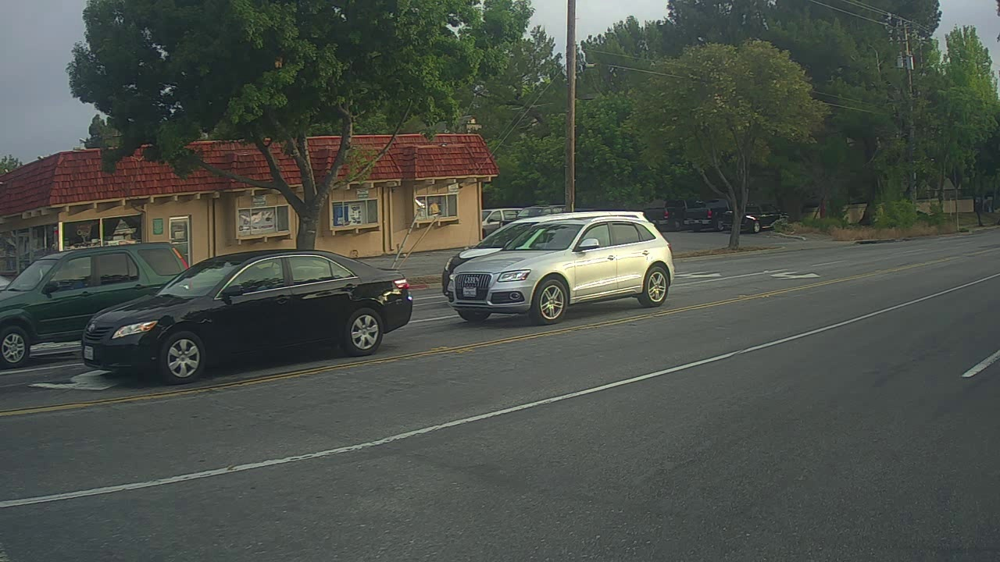
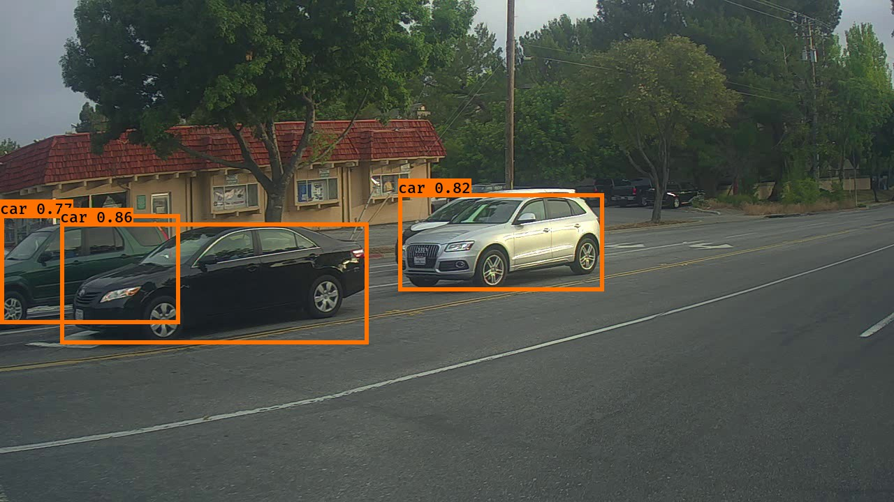
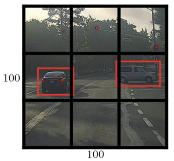
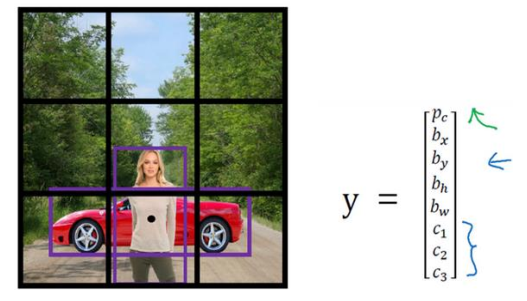
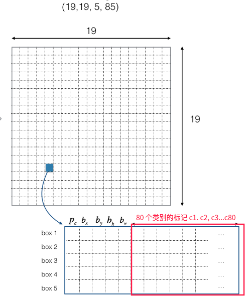
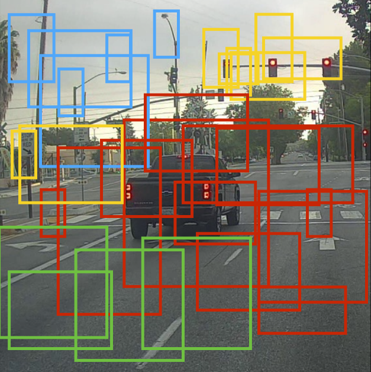
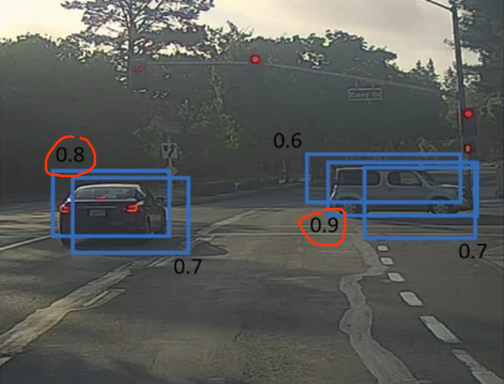
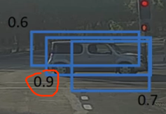
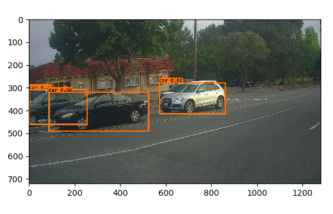

本文章是吴恩达深度学习第四课, 第三周的作业" Autonomous driving - Car detection " 的笔记.

本文会简单说一下YOLO算法是怎么回事, 附上注释过的作业代码, 以及作业中缺少的 yolo.h5 文件的获取方法

## 目标检测

目标检测就是要在图片中找到物体, 用边界框(bounding box)围绕该物体, 并指明该物体的类别.

我们今天要做的就是输入下面的图片:



完成目标检测的效果如下:



想得到这样的结果, 有一个相对粗暴的方法, 就是用 滑动窗口法, 利用不同大小的矩形区域, 利用不同的滑动步长, 在图片上, 自左向右, 自上而下的扫描图片, 然后对每一个扫描结果执行分类算法, 判断是否存在某个物体.这么做显然有不少问题, 比如:

- 难以确定窗口大小, 不能完美的将识别到的物体框住
- 滑动步长难以确定, 步长太大, 导致扫描不精细, 步长太小, 会扫描到的图片有过多的重复部分, 增加计算量

为了解决这样的问题, 大致上形成了两个方向的方法:

1. 第一步先对图片分割成不同的部分, 每个部分大致是某个物体的轮廓, 换句话说就是得到各个物体的候选区域, 第二步再求出候选区域所对应的类别, 以及用矩形标出所在的区域
2. "you only look once", 也就是本文介绍的 YOLOv2 算法(YOLO算法的第二个版本), 为了方便说明,以下均称为YOLO算法

## YOLO

首先引入需要的库:

```python
import argparse
import os
import matplotlib.pyplot as plt
from matplotlib.pyplot import imshow
import scipy.io
import scipy.misc
import numpy as np
import pandas as pd
import PIL
import tensorflow as tf
from keras import backend as K
from keras.layers import Input, Lambda, Conv2D
from keras.models import load_model, Model
from yolo_utils import read_classes, read_anchors, generate_colors, preprocess_image, draw_boxes, scale_boxes
from yad2k.models.keras_yolo import yolo_head, yolo_boxes_to_corners, preprocess_true_boxes, yolo_loss, yolo_body
```

### Bounding Box 

YOLO算法首先将一张图片切割成不同的小格子, 然后判断一个格子中是否存在物体.  判别一个格子是否存在物体的标准是该物体的 中心点 是否落在该格子里. 



当我们找到一个格子里有某个物体时, 我们要用 Bounding Box (边界盒) 来表示: (bx, by, bh, bw). 其中bx, by是指该物体中心点的坐标,  bh, bw是指该盒子的高度和宽度, 如下图所示


 一般为了更好的训练效果, 我们会对这几个数据进行归一化: 图片左上角的坐标为(0,0)，右下角标记为(1,1), 而图中的边框盒大致可以表示为: (0.5, 0.7, 0.3, 0.4) , 进一步, 我们看看这个格子在训练时用到的标签是怎么样的形式:


- pc 表示该格子里含有物体的概率越接近于1, 表示越肯定该格子里含有某个物体. 
- bx, by, bh, bw 就是该物体边框盒的表示
- c1, c2, c3 表示可能的类别, 例如 c1 代表车, c2 代表行人, c3代表交通灯, 同一时刻, 这三个数只有一个数值为1,其他均为0.
- 当pc=0时, 表示该格子只是个背景, 这时候 bx, by, bh, bw, c1, c2, c3 的任何取值都没有意义了

要完成3分类任务时, 我们用了8个维度的向量来表示. 如果我们需要完成n个任务的分类, 那么这个向量的维度就应该是 1 + 4 + n 维. 

当然, 上面说的都是针对一个格子而言的,在这个例子中, 我们刚刚把图片分成了3*3=9个盒子, 如果想表示这九个盒子的数据, 我们一般用(3, 3, 8)的矩阵来表示这九个格子的数据.

而实际上, 我们会将图片分割成更多小格子, 例如19*19, 也可能完成更多物体的分类, 例如80类, 那么 y 的维度就是 (19, 19, 85)

## anchor box

上面提到的边界框 Bounding Box 的宽与高是相对整张图片大小的，而由于各个图片中存在不同尺度和长宽比（scales and ratios）的物体,  也可能一个格子里存在多个物体, 如下所示:



那么原来的表示方法就只能表示二者中的一个, 解决办法是预先定义2个不同形状的anchor box:


 

实际上, anchor box 的数量可能不止2个,  比较常用的是5个.  

由于引入了更多的盒子, 我们也要对结果的标记的维度进行调整, 变为 (19, 19, 5, 85), 其中第三个维度 5 表示使用5个 anchor box : 



调整之后, 每个格子可以有多个预测结果:



但是如何从这么多预测结果中选出最好的那个呢? 

- 先根据由每个格子的概率值过滤一部分不确定是否存在物体的格子
- 对剩下的格子采用非极大值抑制, 仅仅保留一个概率值最高的盒子

## 根据概率值来过滤部分 anchor box

我们使用 YOLO 完成预测时, 会返回这样的数据box_confidence, box_xy, box_wh, box_class_probs, 其中box_xy是中心点的两个坐标,box_wh是宽度和高度, 一般我们会调用

```
boxes = yolo_boxes_to_corners(box_xy, box_wh) 
```

函数来将这样的坐标转换成两个顶点的形式, 便于我们计算IOU(交并比), 这个后面再说.

现在我们有了 box_confidence, boxes, box_class_probs 三个参数:

- `box_confidence`:  也就是前面常提到的pc, 这是 (19,19,5,1)的形式的数据, 前两个19表示有19*19个格子, 5 表示含有5个anchor box, 最后一个维度1表示含有物体的自信程度
- `boxes`: (19,19,5,4) 的数据, 存放所有格子的所有anchor box 的框的顶点信息
- `box_class_probs`:  (19, 19,5,80) 包含所有格子的所有anchor box 属于80个类别的概率 (c1,c2,...c80)

每个anchor box 都有一个box_confidence, 我们将 box_confidence 乘上 (c1, c2,...c80) 来作为最终该 anchor box 属于各个类别的预测概率. 

可以看到, 如果不经过过滤, 那么一张图片上共有 19\*19\*5个框, 然而里面有许多滥竽充数的边框盒 假装自己找到了某个物体,   现在我们来编写yolo_filter_boxes函数来过滤掉这些找到某个物体的概率小于 阈值threshold 的框框, 同时记录下这些框框的得分, 以及所属的类别信息:

```python
def yolo_filter_boxes(box_confidence, boxes, box_class_probs, threshold = .6):
    # 计算所有小格子５个anchor box的分类结果的概率, 得到的维度仍然是 (19, 19,5,80)
    box_scores = box_confidence * box_class_probs
    
    # 计算所有小格子５个anchor box的分类结果中　概率最高的一类　所在的坐标.   shape:（19,19,5）
    # axis=-1 表示取box_class_probs的维度(19,19,5,80) 中的最后一维, 也就是概率所在的维度
    box_classes = K.argmax(box_class_probs, axis=-1)  
    # 计算所有小格子５个anchor box的分类结果中　最高的概率值.   shape:（19,19,5）
    box_class_scores = K.max(box_scores, axis=-1) 
    
    # 计算所有小格子５个anchor box的分类结果中，概率大于threshold的设置为　Ｔrue，否则，设置为False, shape:(19,19,5)
    filtering_mask = box_class_scores >= threshold 
    
    # 在所有小格子的５个anchor box中，去除box_class_scores中　概率得分小于threshold　的部分:
    # 如果filtering_mask[i,j,k]==True, 那么box_class_scores[i,j,k]的数据就得到保留
    # 如果filtering_mask[i,j,k]==False, 那么box_class_scores[i,j,k]的数据就得到保留
    # box_class_scores是三维矩阵，filtering_mask是三维的矩阵，mask之后返回3-3+1=1维的向量
    # 但是这个一维向量的个数是不确定的,由filtering_mask的True的个数决定
    # scores的shape为(?,) 表示这是一维的向量,且元素个数不确定
    scores = tf.boolean_mask(box_class_scores, filtering_mask)
    
    # 在所有小格子的５个anchor box中，去除boxes中　概率得分小于threshold　的部分
    # boxes是四维矩阵，filtering_mask是三维的矩阵，mask之后返回4-3+1=2维的矩阵
    # 但是这个二维向量的 第一个维度  的元素个数是不确定的,由filtering_mask的True的个数决定
    # boxes的shape为(?,4) 表示这是二维的向量,且第一维元素个数不确定, 第二维元素个数为4个
    boxes = tf.boolean_mask(boxes, filtering_mask)
    
    # 在所有小格子的５个anchor box中，去除box_classes中　概率得分小于threshold　
    # classes是三维矩阵，filtering_mask是三维的矩阵，mask之后返回3-3+1=1维的向量
    # 但是这个一维向量的个数是不确定的,由filtering_mask的True的个数决定
    # classes的shape为(?,) 表示这是一维的向量,且元素个数不确定
    classes = tf.boolean_mask(box_classes, filtering_mask)
    
    # 最终保留所有19*19个格子中概率较大的anchor box的分数scores, 边框boxes, 类别classes
    return scores, boxes, classes	
```

argmax, max分别用于返回axis维度上最大值的下标, 与最大值本身, 具体的例子如下:

```python
import numpy as np
a = np.array([
              [
                  [1, 5, 5, 2],
                  [9, -6, 2, 8],
                  [-3, 6, -9, 1]
              ],

              [
                  [-1, 5, -5, 2],
                  [9, 6, 2, 8],
                  [3, 7, 8, 1]
              ]
            ])
# 返回矩阵第三个维度上　最大值
m=np.max(a, axis=2)
print(m, '\n') 

# 返回矩阵第三个维度上　最大值的下标
argmax=np.argmax(a, axis=2)
print(argmax, '\n') 

# 根据矩阵第三个维度上　最大值的下标　来访问最大值
# 下面a[]的第三个维度的值就是矩阵argmax对应位置上的值（argmax对应位置由a[]前两个维度的下标决定）
# 例如a[0,2,  1  ]中, argmax[0,2] 的值为1
# 所以第一二个维度为0,2 第三维度的值为1, 这样就可以得到该位置的最大值6
print(a[0,0,  1  ], a[0,1,  0  ], a[0,2,  1  ])
print(a[1,0,  1  ], a[1,1,  0  ], a[1,2,  2  ])

"""
输出如下:
        [[5 9 6]
         [5 9 8]] 

        [[1 0 1]
         [1 0 2]] 

        5 9 6
        5 9 8
"""
```

## 非最大值抑制

经过上面的步骤, 我们已经去除掉一部分anchor box了, 剩下的部分大概是这样的:



我们要想办法保留概率值最大的边框, 同时去掉多余的框, 最后变成这样:


怎么知道那些框框是可以去掉的呢? 接下来的讲解就得涉及到交并比的计算了


所谓交并比, 就是两个矩形的交集部分除以并集部分的值:


交并比的值越大, 说明重合度越高, 计算方法大致如下:

假设(x1, y1, x2, y2) 中x1,y1 表示左上角的坐标, x2,y2 表示右下角的坐标, 

交集部分的顶点坐标 (xi1, yi1, xi2, yi2) 各个值如下:

1. xi1 = 两个盒子中x1取值较大的一个
2. yi1 = 两个盒子中y1取值较大的一个
3. xi2 = 两个盒子中x2取值较小的一个
4. yi2 = 两个盒子中y2取值较小的一个

根据坐标 (xi1, yi1, xi2, yi2)计算交集部分面积inter_area, 

再计算两个矩形的并集部分面积box1_area + box2_area - inter_area

然后相除即可得到交并比.


接下来的工作就是去除多余的非最大概率值的边框了, 先看看这个图:



显然, 图中 0.9 对应的框 和其他两个框的交并比非常大, 至少大于0.5, 那么我们可以以0.5作为交并比的阈值, 与0.9对应的边的交并比大于0.5的全部去掉, 这样就能得到下面的图片:


这个过程就是非极大值抑制:

1. 选择概率最高的盒子作为参考
2. 计算上面的盒子与其他所有盒子的交并比, 去除掉所有交并比大于 iou_threshold=0.5 的盒子

tensorflow 提供了现成的函数 [tf.image.non_max_suppression()](https://blog.csdn.net/m0_37393514/article/details/81777244) 供我们调用.

现在我们来编写函数 yolo_non_max_suppression 来完成非极大值抑制:

- scores, boxes, classes 是yolo_filter_boxes()的返回值, 也就是过滤一部分数据后的值.

- max_boxes 是表示得到的边框的最大个数
- iou_threshold 是交并比的阈值

```python

def yolo_non_max_suppression(scores, boxes, classes, max_boxes = 10, iou_threshold = 0.5):    
    max_boxes_tensor = K.variable(max_boxes, dtype='int32') 
    K.get_session().run(tf.variables_initializer([max_boxes_tensor])) 
    
    # tf.image.non_max_suppression 用法可以参考以下网址的内容
    # https://blog.csdn.net/m0_37393514/article/details/81777244
    # 得到 去除交并比大于0.5的数据 后留下来的 边框在boxes里的下标
    nms_indices = tf.image.non_max_suppression(boxes, scores, max_boxes_tensor, iou_threshold=iou_threshold)
    
    # 通过tf.gather函数, 传入上面得到的下标, 即可得到保留下来的相关数据:坐标boxes, 得分scores, 类别classes
    boxes = tf.gather(boxes, nms_indices)
    scores = tf.gather(scores, nms_indices)
    classes = tf.gather(classes, nms_indices)
    
    return scores, boxes, classes

```

编写 yolo_eval() 函数, 整合上面的代码,  来将 YOLO 的输出进行过滤, 只保留我们需要的 anchor box:

其中参数 yolo_outputs 是包含4个张量的tuple: (box_confidence, box_xy, box_wh, box_class_probs)

```Python
def yolo_eval(yolo_outputs, image_shape = (720., 1280.), max_boxes=10, score_threshold=.6, iou_threshold=.5):
    box_confidence, box_xy, box_wh, box_class_probs = yolo_outputs
	
    # 转换成用顶点表示的坐标
    boxes = yolo_boxes_to_corners(box_xy, box_wh)

    # 过滤所有 可信度 低于score_threshold的 anchor box
    scores, boxes, classes = yolo_filter_boxes(box_confidence, boxes, box_class_probs, score_threshold)
    
    # 由于YOLO是用608*608的图片训练出来的, 如果想测试其他分辨率的图片, 
    # 我们需要通过下面的函数来对anchor box 的位置和尺寸进行相应的缩放.
    boxes = scale_boxes(boxes, image_shape)

    # 进行 非最大值抑制 
    scores, boxes, classes = yolo_non_max_suppression(scores, boxes, classes, max_boxes, iou_threshold)
    
    return scores, boxes, classes

```

## 利用预训练好的模型完成测试

```python
# 创建一个session
sess = K.get_session()

# 读取类别
class_names = read_classes("model_data/coco_classes.txt")
# 读取 anchor box 的长度和宽度
anchors = read_anchors("model_data/yolo_anchors.txt")
# 设置我们要测试的图片尺寸
image_shape = (720., 1280.)    

"""
载入预先训练好的模型
yolo.h5文件获取方法:
    git clone https://github.com/allanzelener/yad2k.git
    cd yad2k
    wget http://pjreddie.com/media/files/yolo.weights
    wget https://raw.githubusercontent.com/pjreddie/darknet/master/cfg/yolo.cfg
    ./yad2k.py yolo.cfg yolo.weights model_data/yolo.h5
    
打开 https://github.com/allanzelener/YAD2K 底下有详细说明
"""
yolo_model = load_model("model_data/yolo.h5")

# yolo_model 的输出是 (m, 19, 19, 5, 85) 的张量 
# 利用 yolo_head函数 将 YOLO 模型的最后一层输出转换成(box_confidence, box_xy, box_wh, box_class_probs)的tuple形式
yolo_outputs = yolo_head(yolo_model.output, anchors, len(class_names))

# 过滤不需要的 anchor box
scores, boxes, classes = yolo_eval(yolo_outputs, image_shape)
```

编写predict函数来运行上面的计算图, 它的执行过程描述如下:

1. yolo_model.input 作为输入传到 `yolo_model` 中, 得到输出  yolo_model.output
2. yolo_model.output 经过 yolo_head 处理, 得到yolo_outputs
3. yolo_outputs 经过我们编写好的函数 `yolo_eval` 输出预测信息: scores, boxes, classes

注意:  如果一个模型使用了BatchNorm, 那么我们在feed_dict中喂入的数据需要包含{K.learning_phase(): 0}

```python
# 根据图片文件名,输出图片的检测结果
def predict(sess, image_file):

    # 对图片预处理, image_data 会增加一个维度, 变成 (1, 608, 608, 3), 这将作为CNN的输入
    image, image_data = preprocess_image("images/" + image_file, model_image_size = (608, 608))

    # 喂入数据, 运行 session
    out_scores, out_boxes, out_classes = sess.run([scores, boxes, classes], feed_dict={yolo_model.input:image_data, K.learning_phase():0})


    # 打印预测信息
    print('Found {} boxes for {}'.format(len(out_boxes), image_file))
    colors = generate_colors(class_names)
    draw_boxes(image, out_scores, out_boxes, out_classes, class_names, colors)
    image.save(os.path.join("out", image_file), quality=90)
    output_image = scipy.misc.imread(os.path.join("out", image_file))
    imshow(output_image)
    plt.show()
    
    return out_scores, out_boxes, out_classes
```

最后就是调用这个函数, 查看结果了:

```
out_scores, out_boxes, out_classes = predict(sess, image_file="0059.jpg")
```

输出如下:

> 
>
> Found 3 boxes for 0059.jpg
>
> car 0.77 (0, 307) (257, 464)
>
> car 0.82 (570, 277) (864, 417)
>
> car 0.86 (86, 319) (527, 493)