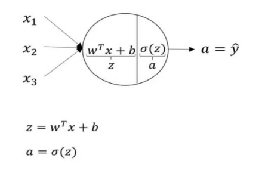
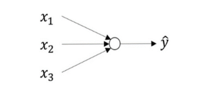
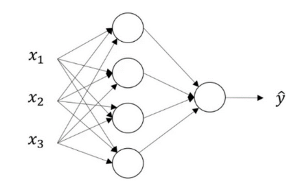
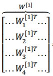
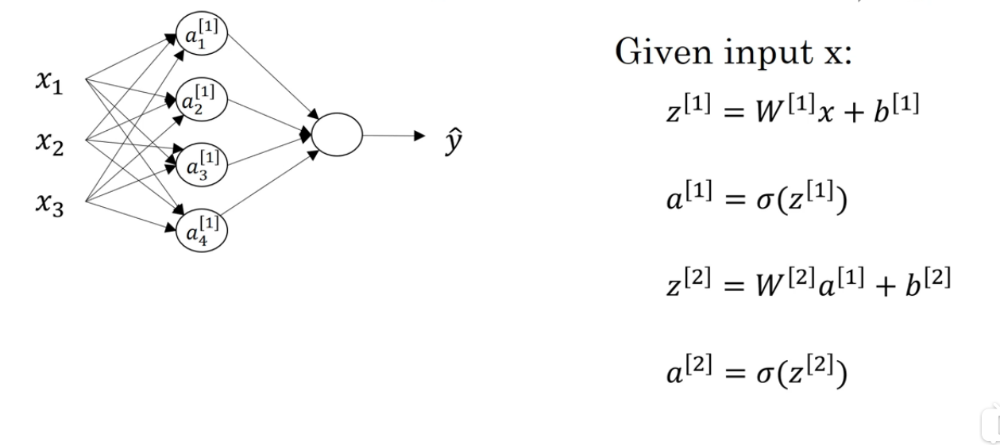
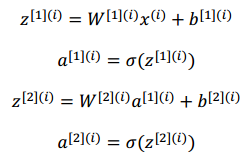
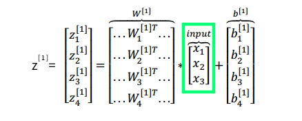
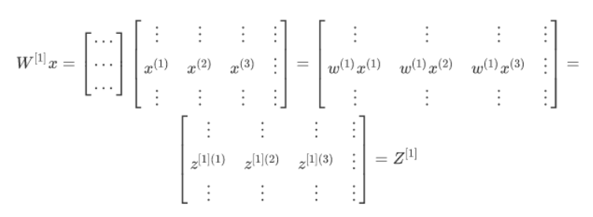

### 神经网络概览

上一篇文章，我们讲述了logistic回归，其模型大致是这样的，得到的 a 便是预测结果 y帽

如果把上面的图片抽象化，可以得到下面的模型：

再进一步简化可以得到：

上图里，小圆圈是sigmoid单元，它要完成的工作就是先计算 z 然后计算 a 最终作为 y帽 输出。

进而，我们看看下图，这是较为简单的神经网络的样子，它无非就是将多个 sigmoid 单元组合在一起，形成了更复杂的结构。图中每个单元都需要接收数据的输入，并完成数据的输出，其每个单元的计算过程与 logistic回归 的正向传播类似。可以看到，图片里给神经网络分了层次，最左边的是**输入层**，也就是第0层；中间的是**隐藏层**，也就是第一层；最右边的是**输出层**，是第二层。通常，我们不将输入层看做神经网络的一层，因而下图是一个2层的神经网络。   另外要清楚的是，本图中隐藏层只有一个，但实际上，隐藏层可以有多个。由于对用户而言，隐藏层计算得到的数据用户不可预见，也没有太大必要知道，所以称之为隐藏层。

再进一步认识下这张图片里的标记，隐藏层的每个单元都需要接收输入层的数据，并且各个单元都需要计算 z , 并经过 sigmoid 函数得到各自的 a ，为了便于区分不同层的不同单元的 a，我们做如下约定：

a 的右上角有个角标[i]，表示这是第i层的单元；a 的右下角有个角标 j 用于区分这是该层自上向下的第 j 个单元。例如我们用 a^[1]_3 表示这是第一层的第三个单元。输入层的 x1, x2, ... xn 可以看做是 a^[0]\_1, a^[0]\_2 ...  a^[0]\_n.           

前一层a[ i ] 的输出，便是后一层 a[ i+1 ] 的**所有单元**输入。除了输入层外的其它层，也就是隐藏层和输出层的单元都有各自的参数 w 和 b 用于计算 z ，同样是用w^[i]\_j, b^[i]\_j, z^[i]\_j 来区分他们；得到 z^[i]\_j 后用sigmoid函数计算 a^[i]\_j ，再将本层n个单元计算得到的n个 a 作为下一层的输入，最终在输出层得到预测值 y帽。其计算过程大致如下：

接下来我们看看具体是怎么计算的。

### 计算一个样本的神经网络输出

下图是输入单个样本(该样本含有特征x1, x2, x3)的神经网络图，隐藏层有4个单元：

根据上面的说明，要计算该神经网络的输出，我们首先要计算隐藏层4个单元的输出：

第一步就是计算第一层各个单元的 z^[1]\_j ，第二步是计算出各个单元的 a^[i]\_j，不难想到可以用**向量化计算**来化简上述操作，我们将所有 w^[1]\_j 的转置纵向叠加得到下图的内容，我们将这个大的矩阵记为W^[1].

由于输入的 x 是三维的列向量，所以每个分量x1, x2, x3 都需要一个 w1, w2, w3 对应，因此     w^[1]\_j 的转置     是一个(1, 3) 的矩阵，又因为隐藏层有4个单元，即 j 的取值为1, 2, 3, 4，故  W^[1] 是  (4, 3) 的矩阵。

同理，第二层，也就是输出层的 W^[2] 由于有4个输入的特征，1个单元，所以 W^[2] 是 (1, 4)的矩阵。

结合上一篇文章学习的内容，对于只有一个样本的情况，我们不难得到如下式子：

z^[1] 是个 (4, 1) 的矩阵。可以再进一步通过 sigmoid 函数得到

这样第一层的任务就完成了。

第二层也就是输出层的工作，无非就是把第一层的 a^[1] 作为输入，继续用 W^[2] 与 a^[1]  相乘 再加上 b^[2] 得到 z^[2]，再通过 sigmoid 函数得到 a^[2] 也就是最终的预测结果 y帽。

整个过程如下图所示：

到此我们就完成了一个样本的输出，接下来我们看看如果用矩阵实现多样本的正向输出。

### 多样本向量化

假设我们有m个样本，每个样本有3个特征，并且隐藏层也是4个单元。

那么，通常我们需要使用一个 for 循环将 从 1 遍历至 m 完成以下操作：

角标 ^(i) 表示第 i 个样本。

我们可以构造这样一个矩阵 x：

它将所有样本的特征，按列叠加在一起，构成 (3, m) 的矩阵。

如果我们替换上面计算 z^[1] 的过程中使用的 单个样本 x^(1) 为(3, m) 的矩阵 x ：

就可以得到下面的式子（为了方便表达，下面的公式中假设 b 等于0）：

也可以参考下面这张图来理解，注意不同颜色的箭头：

到这里，我们求出了 Z^[1] ，并且由于 Z^[1] 是(4, 3)的矩阵W^[1]乘以(3, m)的矩阵x 再加上b，所以它是 (4, m) 的矩阵。再经过 sigmoid 函数即可得到同样是 (4, m) 的矩阵 A^[1]，到此隐藏层的工作完成了。

**接下来进行输出层的工作**：

矩阵 A^[1]，作为下一层（也就是输出层）的输入参数，经过类似的计算也可以得到 Z^[2] = W^[2] × A^[1] + b^[2]，上面我们分析到 W^[2] 是 (1, 4)的矩阵，所以得到的Z^[2]是 (1, m) 的矩阵，同样经过sigmoid函数处理得到的 A^[2] 也是 (1, m) 的矩阵，A^[2]的每个元素，代表一个样本输出的预测值。

到此为止，多个样本的正向传播过程已经都做完了。